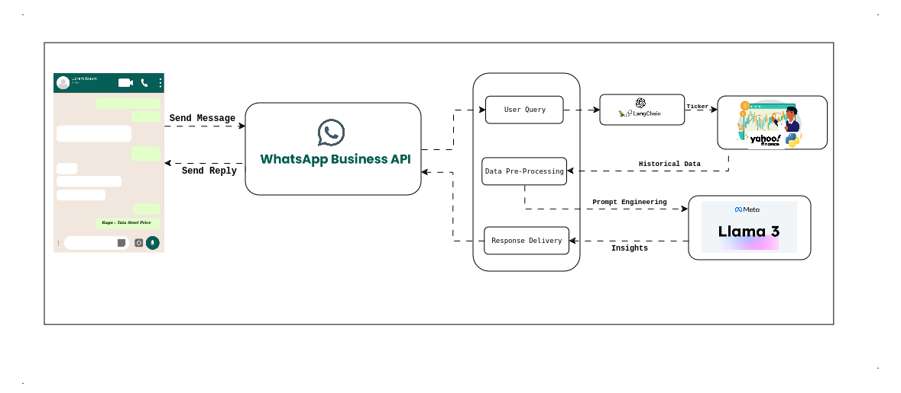

#  Finance Chatbot



## Overview

FinChat-WhatsApp-LAMA3 is a comprehensive finance chatbot system integrated with WhatsApp messaging platform and powered by the LAMA3 language model.  This chatbot provides users with personalized financial advice, investment insights, budgeting tips, and real-time market updates directly through their WhatsApp conversations.

## File Structure

```
.
├── Doc
│   └── Flow.png
├── Readme.md
├── requirements.txt
├── Scripts
│   ├── model.py
│   ├── ticker.py
│   └── yfinance_data.py
└── set-tokens.sh
```

## Installation
To install the required dependencies, run:

```
pip install -r requirements.txt
```

## Setup
Before running any scripts, ensure to set up the necessary tokens by executing:

```
./set-tokens.sh
```
## Running Scripts
To execute the scripts, use the following command:

```
python3 Scripts/model.py
```


